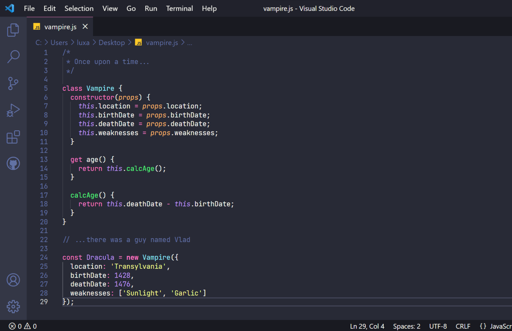

# Dracula for [Codelobster](https://codelobster.com)

> A dark theme for [Codelobster](https://codelobster.com).

## Install

All instructions can be found at [draculatheme.com/foobar](https://draculatheme.com/codelobster).

## Community

* [Twitter](https://twitter.com/draculatheme) - Best for getting updates about themes and new stuff.
* [GitHub](https://github.com/dracula/dracula-theme/discussions) - Best for asking questions and discussing issues.
* [Discord](https://draculatheme.com/discord-invite) - Best for hanging out with the community.

## Team

This theme is maintained by the following person(s) and a bunch of [awesome contributors](https://github.com/dracula/foobar/graphs/contributors).

 |
--- |
[Zeno Rocha](https://github.com/fahrurozi) |

## License

[MIT License](./LICENSE)
